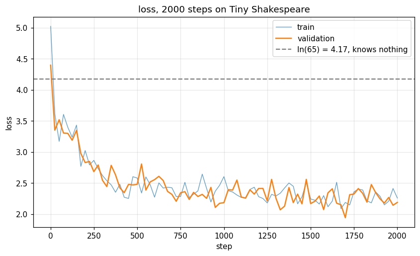
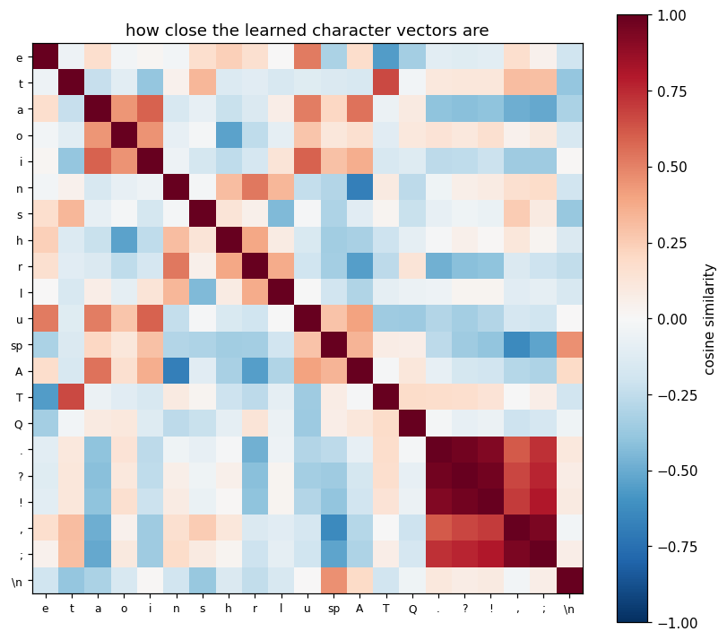

# text-transformer

I was asked to build a text generating transformer from scratch, with no ML library at all. No
PyTorch, no TensorFlow, not even NumPy. So the matrix multiply is three for loops I wrote, softmax
is a loop with `exp` in it, and every derivative in here is one I worked out on paper first.

It trains, and it generates text. It is not a good language model and it was never going to be.
The point was to understand what is actually happening inside one, which is why my notes and my
mistakes are in this repo next to the code.

## What I was allowed to use

`math`, `random`, `json`, `time`, `os`. That is it.

One thing I did not realise at the start: this rule also means no GPU. You can only reach a GPU
through CUDA, and you can only reach CUDA through the libraries I am not allowed to use. So
everything here runs on a single CPU core, one multiplication at a time. That is the reason my
model is tiny: 29,697 parameters, 2 layers, and it can only see 32 characters at a time.

## How it works

The model does one thing. It looks at the characters so far and guesses the next one.

That sounds too small to be useful, but you can get a whole paragraph out of it by just running it
in a loop. Guess a character, stick it on the end of the input, guess again. Do that 400 times and
you have 400 characters of text.

Every character gets turned into a number first (`a` is 39, space is 1, and so on), and then that
number is used to look up a row of 32 numbers from a table. Those 32 numbers are what the model
actually works with. They start random and training moves them around.

Then I add a position vector, because otherwise the model has no idea what order anything is in.
This one took me a while to accept. Attention compares pairs of vectors, and comparing pairs does
not care about order, so "dog" and "god" would look identical without it.

Then comes attention, which is the only place where the characters get to look at each other. Every
position makes three vectors out of itself: a query (what am I looking for), a key (what am I, for
someone else to match against) and a value (what I will hand over if I get picked). Then I dot every
query with every key, which gives me a grid of scores saying how much each position wants each other
position. Softmax turns each row of that grid into weights adding up to 1, and the output for a
position is the weighted mix of everyone's value vectors.

The important bit is that a position is only allowed to look backwards. Before the softmax I set
every future cell to minus infinity, so after `exp` they come out as exactly 0. I got to this from
the definition of the problem rather than from a diagram: if you write out what each position is
allowed to see, you get a triangle, and that triangle is the mask. Working that out by hand is in
[docs/notes.md](docs/notes.md).

After attention each position goes through a small network on its own (32 numbers out to 128 and
back to 32) with a relu in the middle. The relu has to be there. Two linear layers with nothing
between them collapse into one linear layer, so without it the extra depth is pointless.

Both of those are wrapped in `x + f(x)` instead of just `f(x)`. Two reasons I understand now. The
layer only has to learn a change to x rather than rebuild it, and on the way back the derivative of
`x + f(x)` is `1 + f'(x)`, so that 1 gives the gradient a clear path to the input. Without it the
gradients get weak by the time they reach the early layers.

All of that is one block, and I stack two of them. At the end a layernorm, then one more matrix to
turn 32 numbers into 65 scores, one score per possible character. Those scores are called logits.
Softmax turns them into probabilities and I pick from them.

Shapes end to end, which is the thing I kept drawing on paper while debugging:

```
 ids                (32,)       32 character ids
   embedding        (32, 32)    each character becomes 32 numbers
   + positions      (32, 32)    same shape, now they know where they are
   block 1          (32, 32)
   block 2          (32, 32)
   layernorm        (32, 32)
   output head      (32, 65)    65 scores at every position
   softmax          (32, 65)    pick from this
```

The width stays 32 the whole way through the middle. Every block reads from that and adds its
result back in.

## Training it, and the part that took longest

There is no `loss.backward()` here, so I had to write the backward pass for every layer myself.
This was easily the hardest part of the project and most of my time went into it.

Each layer has its own `backward()`. It gets the gradient coming in from the layer after it, adds
to the gradients of its own weights, and returns the gradient to pass down to the layer before it.
Nothing knows about the rest of the network, which is what makes it possible to do by hand.

What made it click was noticing that the backward pass is the forward pass in reverse, almost line
for line. `out = probs @ V` becomes `dprobs = dout @ V.T` and `dV = probs.T @ dout`. The shapes only
fit together one way, so when I was not sure whether a transpose belonged somewhere I wrote the
shapes down and there was only one arrangement that worked. That trick caught two of my mistakes.

The derivations I actually had to do on paper are in [docs/math.md](docs/math.md). The nicest one is
softmax with cross entropy, where all the messy terms cancel and the gradient turns out to be just
`predicted - actual`.

Then Adam to update the weights. I wrote plain gradient descent first so I understood what Adam was
adding: it keeps a running average of each weight's gradient to smooth the direction, and a running
average of the squared gradient so that weights with big gradients take small steps and vice versa.

## Was any of it right?

This is the part I would show first, because a wrong backward pass still gives you a loss curve
that goes down. It just goes down to the wrong place, and you would never know.

So I checked every gradient against the definition of a derivative. Nudge one weight up by a tiny
amount, nudge it down, see how much the loss moved, and compare that to what my `backward()`
claimed:

```
numerical = ( loss(w + h) - loss(w - h) ) / 2h
```

Worst disagreement across 128 sampled weights was 3.7e-08, covering matmul, softmax, layernorm,
attention, the residuals and the embedding. Without this test I would just be hoping.

Two more that mattered.

I made the model memorise a single batch, over and over, until the loss went from 2.51 down to
0.00096. If it cannot memorise one batch then something in the chain is broken, and it is much
better to find that out in 75 seconds than after an hour of training.

And I tested that a character in the future cannot change an output in the past. Change a later
character, and every earlier output has to come out identical. This one is worth having because if
the mask leaks, the loss looks *better*, not worse, and I would have happily believed it.

## Results

Trained on Tiny Shakespeare, 1.1 million characters, 65 different characters in it. 2000 steps,
70 minutes, about 1.9 seconds per step.

Loss started at 5.02 and finished at 2.19 on held out text. A model that knows nothing would sit at
`ln(65) = 4.17`, so 2.19 means it learned something real.

```
KING RICHARD:

Wit haw brest how his tast tour amar tworne,
And shive by tore shives, coue hanceld
Bun he she sond this him hall torre,
Shall ling blave lery thar thee with tas hat, lande wather all cand hastess ting
Heell shallost the st she my the scold.

COUCICESTUS:
Showes lond lichemees lich somerave
```

It picked up the layout of a play by itself. A name in capitals, a colon, a line break, then a
capital letter. `COUCICESTUS` is not a real name but it has exactly the right shape, and nothing
told the model that pattern exists. There are real words in there too, mostly the short common ones,
and the spacing and word lengths look about right.

The long words are nonsense, and that is where the number 2.19 becomes useful. If you work out
`e` to the power 2.19 you get about 9, which means at every character the model is effectively
choosing between around 9 options. Nine-way guesses chained together give you the right shape with
the wrong letters, which is exactly what those samples look like.

It cannot do grammar at all, and I do not think it could. The whole context is 32 characters, about
six words, so it never sees a full sentence.

The other thing I found is that it is underfitting, not overfitting. Validation loss stayed at or
below training loss the entire run, which means the model is too small for the data rather than
memorising it. So the limit here is model size and compute, not the amount of text.

## The plots

[src/visualise.py](src/visualise.py) draws four of them with matplotlib. I used a plotting library
here on purpose: the rule was that nothing else can do the model's math, and matplotlib only draws
pictures. All four, with what I think each one shows, are in
[docs/visuals/notes.md](docs/visuals/notes.md).



Two things surprised me.

The heads are doing different jobs. In the first block, one head sits almost entirely on the
diagonal, so it is basically watching the previous character. In the second block, a head keeps
looking back at the start of the line instead of at its neighbours, and I think that is what
produces the `NAME:` layout in the samples. Local first, then structure, which would explain why
two layers do better than one.

And the embedding table sorted itself out on its own. Measuring the angle between rows, `.` and `?`
came out at 0.96 and `.` and `!` at 0.92, so those three ended up as nearly the same vector. That
makes sense once you think about what the model needs them for: all three are followed by a space
or a newline and then a capital, so for guessing the next character they are interchangeable. Upper
and lower case pairs found each other too, `t` with `T` at 0.66, `a` with `A` at 0.55. Nothing in
my code connects them. They are just two unrelated ids that happen to behave the same way in text.



That dark red block in the corner is the punctuation. But I am not going to pretend all of it is
meaningful. `z` came out close to `v` at 0.80, and I cannot justify that. My guess is that rare
characters never get enough gradient to be pushed anywhere, so they keep most of their random
starting values and any similarity between two of them is noise.

## Running it

Nothing to install, just Python 3.

```bash
python tests/test_gradcheck.py
```

```bash
python src/train.py overfit
```

```bash
python src/train.py train
```

```bash
python src/generate.py 400 0.8 10 "KING RICHARD:"
```

```bash
python src/visualise.py
```

I would run the tests and then `overfit` before starting any long run. `train` needs
`data/input.txt`, and [data/README.md](data/README.md) says where I got it and what is in it.

## The files

`matrix.py` is the toolbox, matmul and transpose and so on, and everything else calls into it.
`tokenizer.py` turns characters into ids. `dataset.py` cuts the text into windows and shifts them
by one to make the targets. `layers.py` has the linear layer, layernorm, the embedding and softmax,
each with its backward. `attention.py` is the interesting one. `block.py` puts attention and the
feed forward layer together with the residuals. `model.py` stacks it all up. Then `loss.py`,
`optim.py`, `train.py`, `generate.py` and `visualise.py`.

Two decisions worth explaining, because both are different from how a real library does it.

I did not build a general autograd engine. I had planned to, where you record a graph of operations
and walk it backwards, but I wrote the backward passes by hand instead and got to a working training
run much sooner. The cost is that if I add a new layer I have to derive its backward myself.

And a batch here is a loop over sequences, not an extra dimension on every matrix. So everything
stays 2D. In pure Python the whole thing is stuck in for loops anyway, so the extra dimension would
have made the shapes harder to keep track of and bought me nothing.

## What I got wrong, and what I would do next

I predicted the run would start at 4.17 and it started at 5.02. Not a bug in the end. My output
layer starts with weights big enough that the very first guesses already have opinions, so the model
starts out confidently wrong, and being confidently wrong costs more than knowing nothing.
`ln(65)` is really the loss when all 65 scores are equal, which is only the same thing as an
untrained model if the starting weights are small enough. That is the one change I want to make
next.

My gradient check also failed the first time I ran it, and I spent twenty minutes convinced my
layernorm derivative was wrong. It was not. The test was comparing two numbers that were both
essentially zero, and dividing float noise by float noise gives you anything. Written up properly in
[docs/errors/](docs/errors/).

After the init fix, the obvious thing is more steps, since the loss was clearly still dropping when
I stopped it. Then a wider model, then a longer context. One change at a time so I can actually tell
what did what.

Things I still do not understand are in [docs/questions.md](docs/questions.md), and what I did on
which day is in [docs/log.md](docs/log.md).
