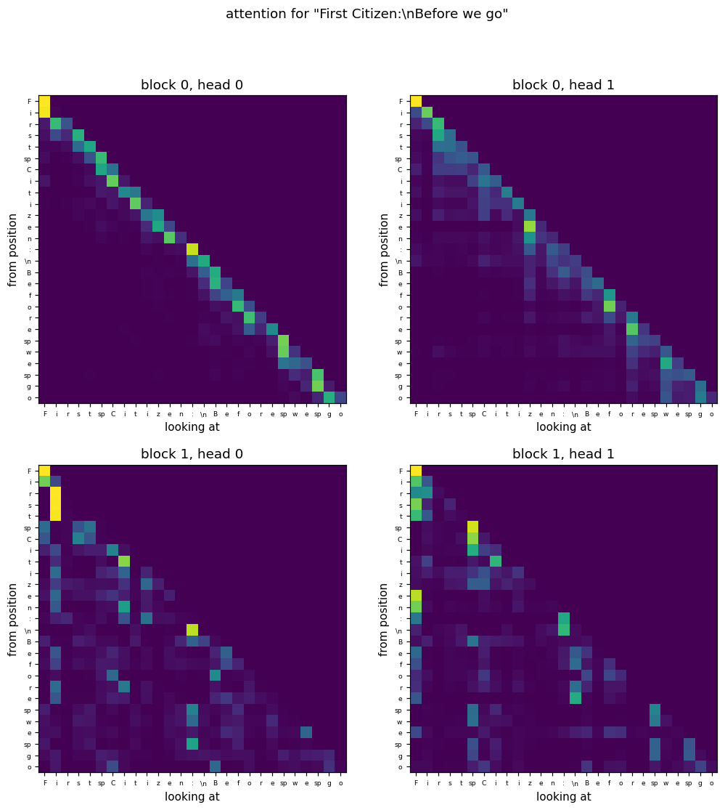
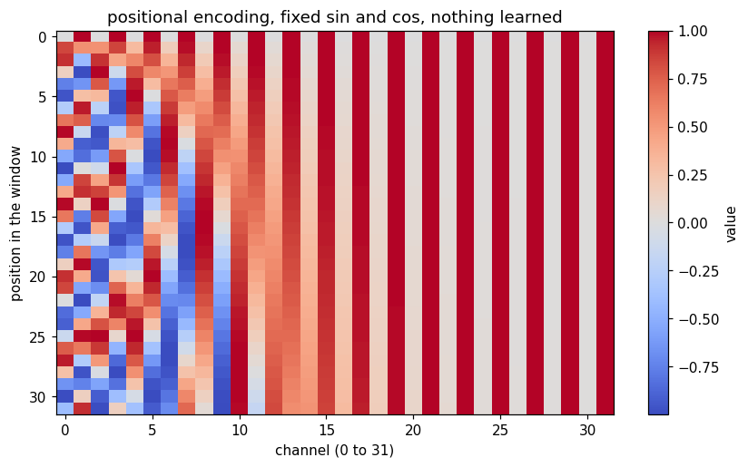

# The plots

All four come from `python src/visualise.py`, using the checkpoint from the Shakespeare run.
I used matplotlib for these. It only draws pictures, it does none of the model's math.

## Loss

The dashed line at 4.17 is `ln(65)`, which is what the loss is when the model has no idea and
spreads its guess evenly over all 65 characters. Anything below that line means it learned
something.

The first drop, down to about 3.4 in under 100 steps, is not the model getting clever. It is just
learning that some characters are far more common than others. Space is 15% of the text and `e` is
8%, so guessing in proportion already beats guessing evenly. Cheap, and it happens fast.

From about 100 to 700 it goes down to 2.4, and that is where it starts using the previous character
or two. After that it flattens out and grinds slowly with a lot of noise.

The noise is because each point is one batch of only 4 sequences, so every measurement is a small
sample. The important thing is that validation (orange) sits on top of training (blue) the whole
way instead of drifting above it. That means the model is not memorising the training text. It is
underfitting, so it is too small rather than too big, and more steps or a bigger model would still
help.

## Attention

Each square is one head. Cell (row i, column j) is how much position i looked at position j.
Everything above the diagonal is dark because of the causal mask, since a position is not allowed
to see the future.

Block 0 head 0 is a clean diagonal line. That head is looking at the current and previous character
and almost nothing else. Local, and it is the obvious first thing to learn.

Block 0 head 1 has the diagonal too but blurrier, spread over a few characters back.

The two heads in block 1 look completely different. Instead of a diagonal they have bright vertical
stripes, mostly on column 0 (the first character) and on the space and colon columns. So those heads
are not watching the neighbouring character at all, they keep looking back at fixed anchor points in
the line. My guess is that this is what produces the `NAME:` and newline layout in the samples,
since to know you are inside a speaker name you need to know where the line started.

So the blocks are not doing the same job twice. The first one handles what just happened, the second
one handles where we are. That would explain why 2 layers do better than 1.

I did have this partly wrong at first. Reading it off a text version I thought the stripe was on the
`z` of "Citizen". Once it was an actual image it was obviously column 0 and the punctuation columns.

## Embedding

Each cell is the angle between two characters' learned vectors. Red means they point the same way,
white means unrelated, blue means opposite. The diagonal is dark red because everything matches
itself.

The dark red block in the bottom right corner is the thing worth looking at. `.` `?` `!` `,` `;`
all ended up nearly on top of each other, `.` and `?` at 0.96. Nothing in my code says those are
related. They are just five unrelated ids. They ended up together because for guessing the next
character they are interchangeable, since all of them are followed by a space or a newline and
usually then a capital.

Same thing in a smaller way with the vowels, `a`, `o`, `i` and `u` are all mildly red with each
other. And `t` with `T` at 0.66, `a` with `A` at 0.55, so upper and lower case pairs found each
other as well.

Not all of it is meaningful. `z` sits at 0.80 with `v`, which I cannot justify. Rare characters
barely appear, so they barely get any gradient, so they keep most of their random starting values
and any similarity between two of them is probably noise.

## Positional encoding

This one is not learned, it is a fixed table of sin and cos values that gets added to the character
vectors. Every row is one position in the window.

Reading left to right, the waves get slower. The fast channels on the left flip between red and blue
every row or two, so they separate neighbouring positions. The slow ones on the right barely change
over the whole window, so they say roughly how far into the window you are.

Put together, every row is a different pattern, which is how the model can tell position 3 from
position 20. Without this the model would see an unordered bag of characters, because attention only
compares pairs of vectors and comparing pairs says nothing about order.
